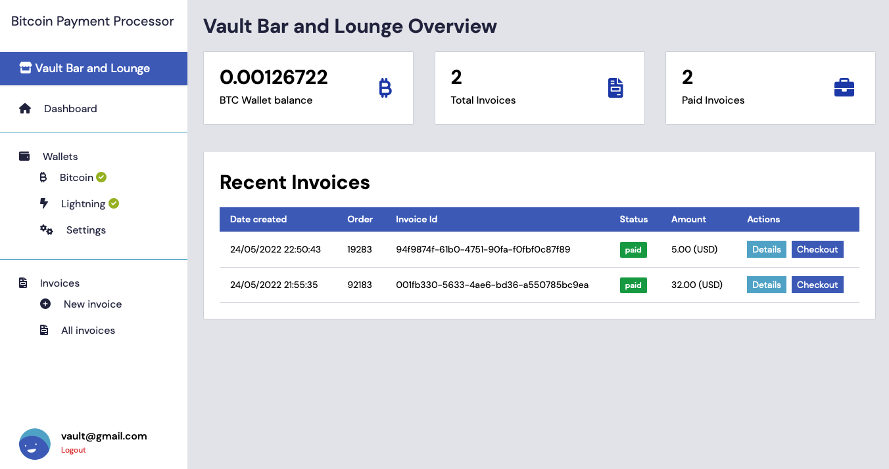

## BTC Payment Processor
An open-source non-custodial Bitcoin payment processor that empowers business and individuals to accept bitcoin without any intermediaries. 



### How it works

Anyone can setup an account in 5 seconds and start creating invoices. A unique link is generated for each invoice which can be shared with the customer. At checkout, the customer is presented with a BIP21 invoice that they can pay from a BIP21-enabled wallet ([Still not mainstream](https://bitcoinqr.dev)). Luckily BPP has fallbacks for SegWit P2WPKH addresses and BOLT 11 lightning invoice. BPP listens for a payment and once settled, notifies the user and customer. 

### Wallets

For the best experience, users link their wallets at onboarding:

- Bitcoin Wallet: BPP generates a watch-only BTC wallet through your extended public key, which is also used to generate addresses for your invoices. 
  
- Lightning: Users have to connect their `lnd` nodes by providing: Server IP:Port, Hex values of their admin.macaroon and tls.cert files

### Getting Started

#### Backend:
```
% cd backend
% npm i
% npm run dev
```
Before you run `npm run dev`:

Make the necessary changes to config/config.json. We use Sequelize to interact with our MySQL database. You can use any relational database you want. Ensure you have `sequelize-cli` installed, then run `npx sequelize-cli db:migrate`. You can now run `npm run dev` at which point, you should see *Database Connected Successfully* in your terminal.

#### Frontend:
```
% git clone https://github.com/tobi-bams/BTC-Payment-Processor.git
% cd frontend
% npm i
% npm start
```

**One more thing:** Create a .env file in your backend root set your JWT token variable e.g: `JWT_SECRET_TOKEN=Secret` 

You are now ready to start creating invoices and accepting Bitcoin.

### Pending:
- Integrating Submarine Swaps. This introduces convenience for the merchant and their clients. 
- Adding integrations for conventional ecommerce platforms like WooCommerce and Shopify so merchants can accept Bitcoin Payments. 
  

### Credit
The incredible supportive team at [Qala](https://qala.dev) 